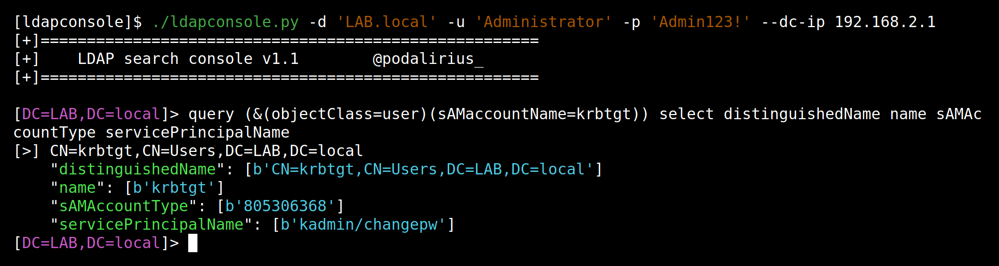

<p align="center">
  The ldapconsole script allows you to perform custom LDAP requests to a Windows domain.
  <br>
  
  <a href="https://twitter.com/intent/follow?screen_name=podalirius_" title="Follow"></a>
  <br>
</p>

## Features

 - [x] Authenticate with password
 - [x] Authenticate with LM:NT hashes
 - [x] Authenticate with kerberos ticket

## Examples

```sh
./ldapconsole.py -u 'user1' -p 'Admin123!' -d 'LAB.local' --dc-ip 192.168.2.1
```



## Contributing

Pull requests are welcome. Feel free to open an issue if you want to add other features.
